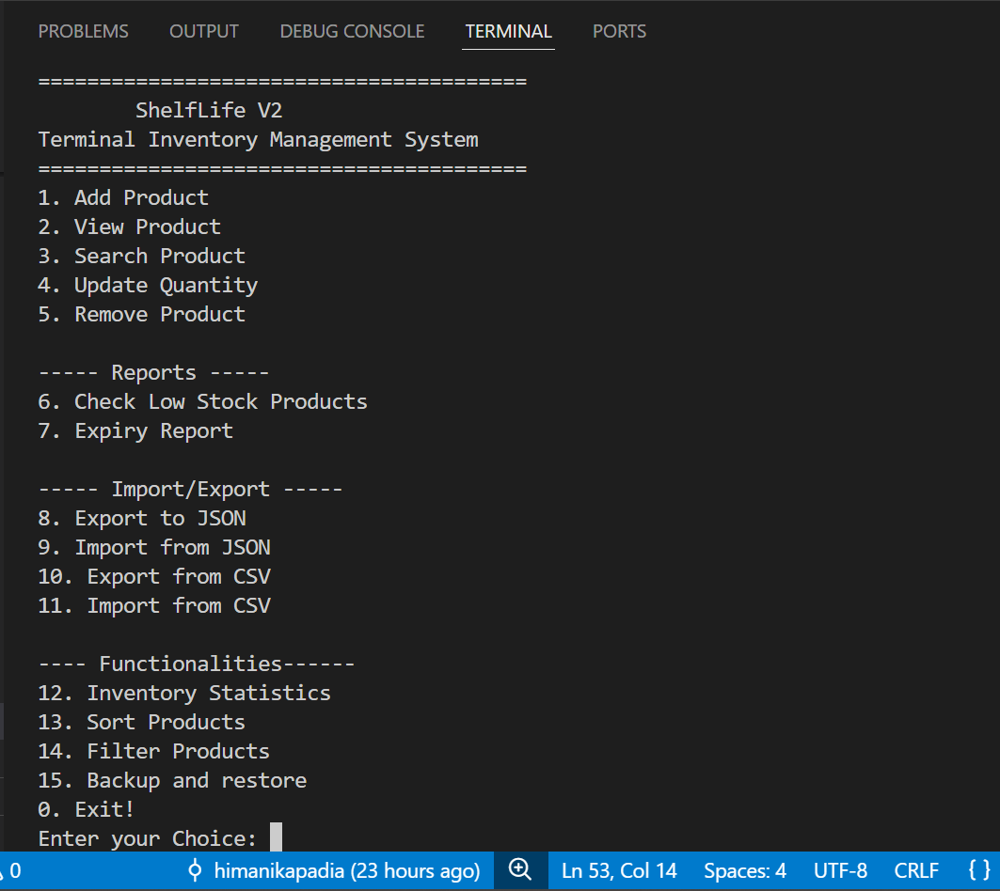
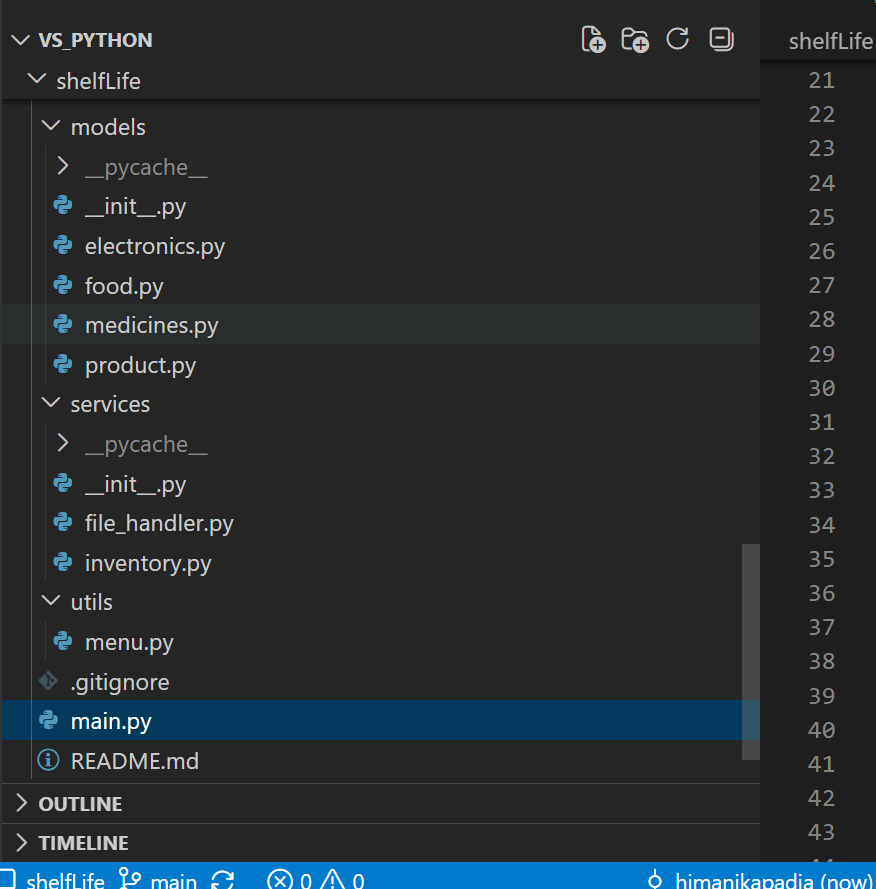
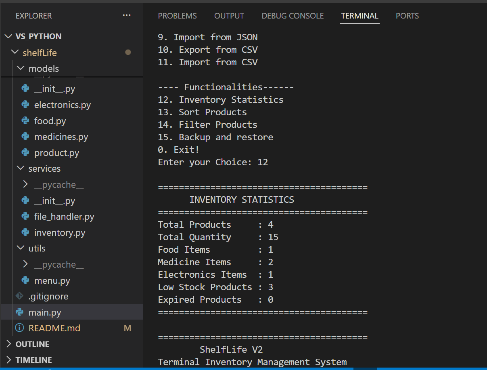
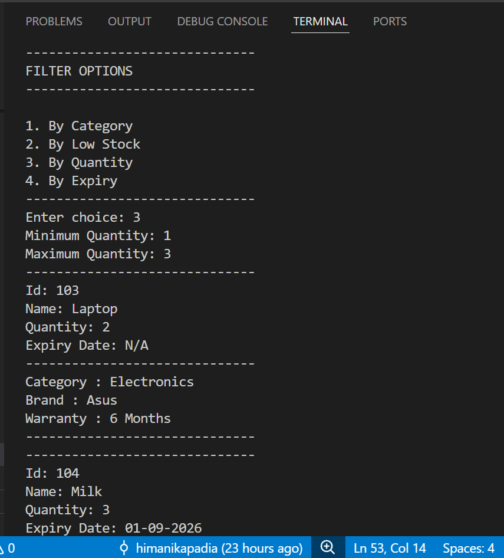

# 📦 ShelfLife v3.0

ShelfLife is a terminal-based inventory management application built in Python to practice Object-Oriented Programming (OOP), file handling, and modular software design.

The project is developed incrementally, with each version introducing new Python concepts and features. What started as a simple inventory manager is gradually evolving into a complete inventory management system.

> **Project Goal:** Learn Python by building a real-world application—from OOP fundamentals to File Handling, Databases, GUI development, and finally a Django web application.

---

# ✨ Features

### - Inventory Management
- Add new products
- View all products
- Update product quantity
- Remove products

### - Product Search
- Search by ID
- Search by Name
- Search by Category

### - Inventory Reports
- Low Stock Report
- Expiry Report
- Inventory Statistics

### - Product Utilities
- Sort Products
- Filter Products

### - File Management
- Automatic inventory save
- Automatic inventory load
- Export to JSON
- Import from JSON
- Export to CSV
- Import from CSV
- Backup inventory
- Restore inventory

### - Validations
- Duplicate Product ID detection
- Input validation
- Exception handling

---

# 🧠 OOP Concepts Demonstrated

ShelfLife demonstrates several core Object-Oriented Programming concepts.

## - Classes & Objects

Creating reusable Product and Inventory objects.

## - Constructors

Using `__init__()` to initialize objects.

## - Encapsulation

Private attributes protect important product information.

```python
__id
__quantity
__expiry_date
```

## - Inheritance

```text
                Product
                   │
        ┌──────────┼──────────┐
        │          │          │
      Food     Medicines   Electronics
```

Child classes inherit common functionality from the Product class.

## - Method Overriding

Each product type overrides the `display()` method.

## - Runtime Polymorphism

```python
for product in products:
    product.display()
```

Python automatically calls the correct display method depending on the object type.

## - Composition

Inventory manages multiple Product objects.

##  Object Interaction

Objects communicate through methods instead of directly accessing internal data.

---

# 📁 Project Structure

```text
ShelfLife/
│
├── assets/
│
├── data/
│   ├── inventory.txt
│   ├── inventory.json
│   ├── inventory.csv
│   └── backup.txt
│
├── models/
│   ├── product.py
│   ├── food.py
│   ├── medicines.py
│   └── electronics.py
│
├── services/
│   ├── inventory.py
│   └── file_handler.py
│
├── utils/
│   └── menu.py
│
├── main.py
└── README.md
```

---

# - Terminal Menu

```text
========================================
        📦 ShelfLife v1.3
========================================

1. Add Product
2. View Products
3. Search Product
4. Update Quantity
5. Remove Product
6. Low Stock Report
7. Expiry Report
8. Export JSON
9. Import JSON
10. Export CSV
11. Import CSV
12. Inventory Statistics
13. Sort Products
14. Filter Products
15. Backup Inventory
16. Restore Inventory
0. Exit
```

---

# 📌 Product Categories

## - Food

- Expiry Date
- Storage Type

## - Medicines

- Expiry Date
- Manufacturer
- Prescription Required

## - Electronics

- Warranty
- Brand

---

# - Version Roadmap

## ✅ Version 1

- OOP Fundamentals
- Inventory Management
- Inheritance
- Polymorphism
- Encapsulation

---

## ✅ Version 2

- File Handling
- Automatic Save & Load
- JSON Export / Import
- CSV Export / Import
- Better Exception Handling

---

## ✅ Version 3 (Current)

- Inventory Statistics
- Product Sorting
- Product Filtering
- Backup & Restore
- Duplicate Product ID Validation
- Code Improvements

---

## 🚀 Version 4

- SQLite Database
- SQL CRUD Operations
- Persistent Database Storage
- Advanced Searching

---

## 🖥️ Version 5

- Tkinter / CustomTkinter GUI
- Dashboard
- Tables
- Forms

---

## 🌐 Final Version

- Django
- Authentication
- Product Analytics
- Email Notifications
- Deployment

---

# 📈 Learning Journey

```
Python Basics
      ↓
Object-Oriented Programming
      ↓
Inheritance & Polymorphism
      ↓
File Handling
      ↓
JSON / CSV
      ↓
Inventory Analytics
      ↓
SQLite
      ↓
GUI
      ↓
Django
```

---

# 🛠 Technologies Used

- Python 3
- Object-Oriented Programming
- File Handling
- JSON
- CSV
- shutil
- datetime
- Terminal / Command Line Interface

---

# 📸 Screenshots

## 🏠 Main Menu



## 🗂️ Project Structure



## 📊 Inventory Statistics



## 🔍 Filter Products



## 🔎 Search Products


---

# 🎯 Current Status

**Current Version:** **v1.3**

✅ Modular Architecture

✅ Inventory Management

✅ File Handling

✅ JSON & CSV Support

✅ Inventory Statistics

✅ Sorting & Filtering

✅ Backup & Restore

✅ Duplicate ID Validation

---

# 🌟 Future Vision

ShelfLife is a long-term learning project that grows with every new Python concept.

The goal is to transform it from a simple terminal application into a complete, production-ready inventory management system featuring:

- SQLite Database
- Desktop GUI
- Django Web Application
- Product Analytics
- Authentication
- Cloud Deployment

Each version reflects a new stage in my Python learning journey.