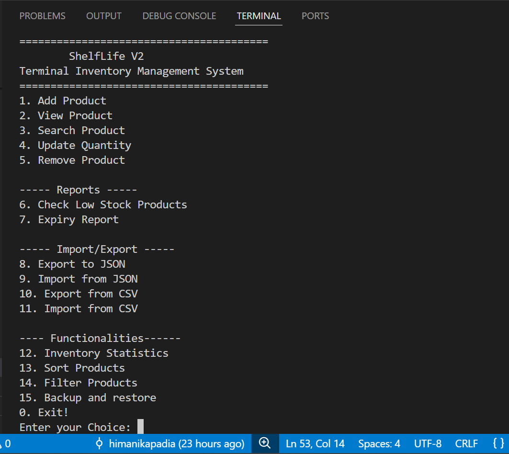
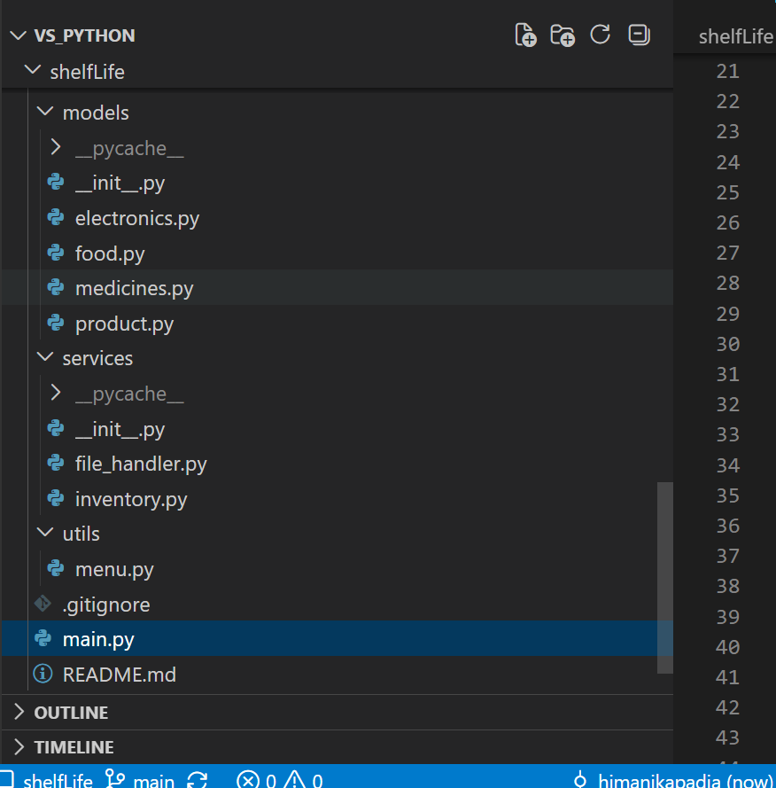
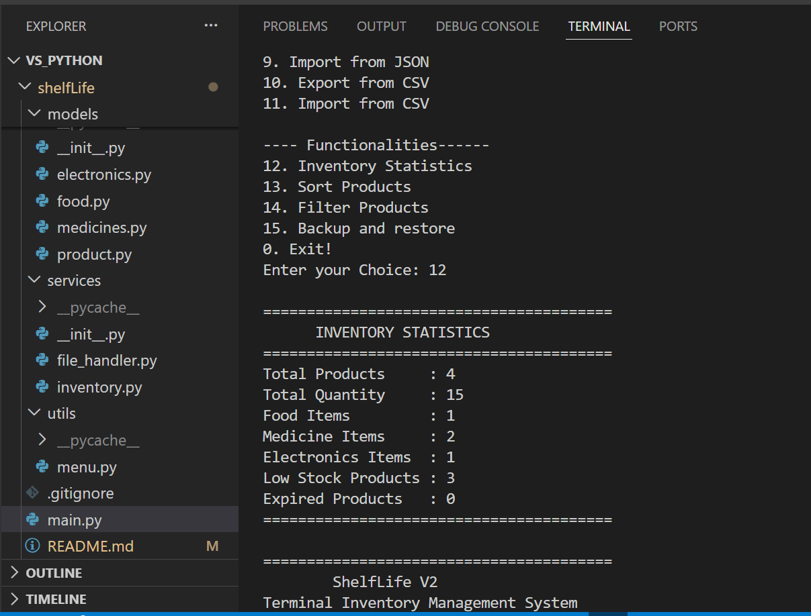
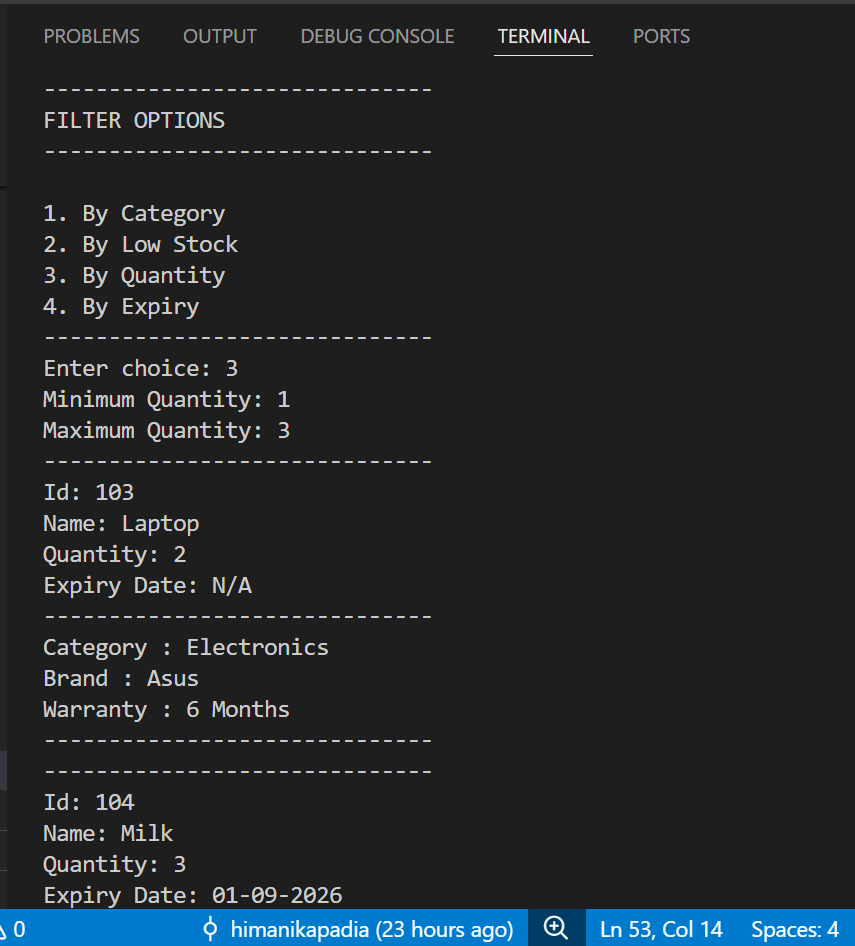
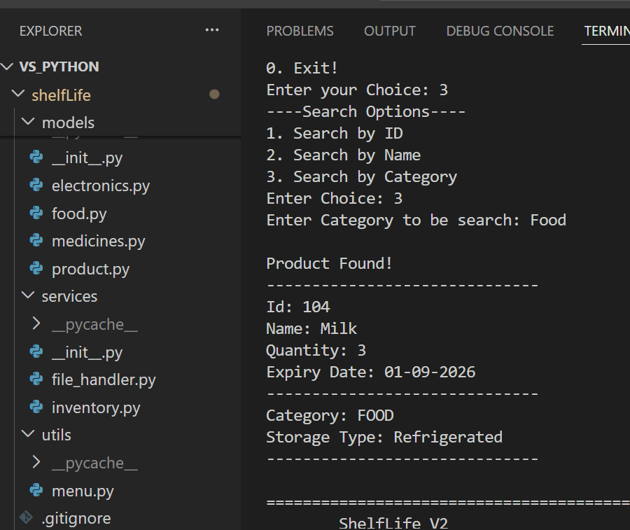

# ShelfLife v4.0

ShelfLife is a Python-based inventory management system built as a long-term software development project.

The project started as a terminal-based application focused on Object-Oriented Programming and gradually evolved through file handling, data management, SQL, and database architecture.

Version 4 introduces SQLite database integration and advanced SQL functionality, providing the foundation for the next stage of the project: a Django-based web application.

---

## Project Goal

ShelfLife is built to learn and apply software development concepts by continuously evolving the same real-world application.

The project progression is:

```text
Python & OOP
     ↓
File Handling
     ↓
JSON / CSV
     ↓
Inventory Management
     ↓
SQLite & SQL
     ↓
Database Architecture
     ↓
Django Web Application
     ↓
Deployment
```

---

## Features

### Inventory Management

- Add new products
- View products
- Update product quantity
- Remove products
- Persistent database storage

### Product Search

- Search by ID
- Search by name
- Search by category

### Inventory Reports

- Low stock report
- Expiry report
- Inventory statistics
- Category reports
- SQL-based reports

### Product Utilities

- Sort products
- Filter by category
- Filter by quantity
- Filter low-stock products
- Filter by expiry

### File Management

- JSON export/import
- CSV export/import
- Inventory backup
- Inventory restore

### Database Features

- SQLite database integration
- SQL CRUD operations
- Database persistence
- SQL Views
- INNER JOIN
- LEFT JOIN
- GROUP BY
- HAVING
- Subqueries
- Database indexes
- Transaction handling

### Validation & Error Handling

- Duplicate product ID detection
- Input validation
- Exception handling
- Database error handling

---

## OOP Concepts Demonstrated

ShelfLife demonstrates practical Object-Oriented Programming concepts through its product and inventory architecture.

### Classes & Objects

The application uses reusable classes such as:

- `Product`
- `Food`
- `Medicines`
- `Electronics`
- `Inventory`

### Constructors

Objects are initialized using `__init__()`.

### Encapsulation

Product attributes are protected using private attributes such as:

```python
__id
__quantity
__expiry_date
```

### Inheritance

The product hierarchy is structured as:

```text
                    Product
                       │
          ┌────────────┼────────────┐
          │            │            │
        Food       Medicines    Electronics
```

Each specialized product inherits common functionality from the base `Product` class.

### Method Overriding

Different product types implement their own `display()` behavior.

### Runtime Polymorphism

```python
for product in products:
    product.display()
```

The appropriate implementation is called based on the actual product object.

### Composition

The `Inventory` class manages a collection of product objects.

---

## Database Architecture

Version 4 introduced a dedicated database layer.

```text
main.py
   │
   ↓
Inventory
   │
   ↓
database.py
   │
   ↓
SQLite
   │
   ├── products
   └── category_details
```

The database layer handles product persistence, searching, updating, deletion, reporting, and SQL operations.

---

## SQL Concepts Implemented

ShelfLife V4 goes beyond basic CRUD operations and implements practical SQL concepts.

### JOINs

```sql
INNER JOIN
LEFT JOIN
```

Used to combine product information with category information.

### GROUP BY

Used for category-level inventory summaries.

### HAVING

Used to filter grouped results.

### Subqueries

Used for advanced inventory analysis, such as comparing products against average quantities.

### Indexes

Indexes are applied to frequently searched fields to improve database query performance.

### Transactions

Database updates use commit and rollback handling to maintain data consistency.

---

## Project Structure

```text
ShelfLife/
│
├── assets/
│   ├── menu.png
│   ├── project_structure.png
│   ├── inventory_statistics.png
│   ├── filter_products.png
│   └── search_functions.png
│
├── models/
│   ├── product.py
│   ├── food.py
│   ├── medicines.py
│   └── electronics.py
│
├── services/
│   ├── inventory.py
│   ├── database.py
│   └── file_handler.py
│
├── utils/
│   └── menu.py
│
├── data/
│
├── inventory.db
│
├── main.py
└── README.md
```

---

## Product Categories

### Food

- Expiry date
- Storage type
- Quantity

### Medicines

- Expiry date
- Manufacturer
- Prescription requirement
- Quantity

### Electronics

- Warranty
- Brand
- Quantity

---

## Version Roadmap

### Version 1 — OOP Foundation

Completed:

- Classes and objects
- Constructors
- Encapsulation
- Inheritance
- Method overriding
- Polymorphism
- Composition
- Basic inventory management

### Version 2 — File Handling

Completed:

- Text file storage
- Automatic save/load
- JSON export/import
- CSV export/import
- Backup and restore
- Improved exception handling

### Version 3 — Inventory Features

Completed:

- Inventory statistics
- Product sorting
- Product filtering
- Search functionality
- Low stock reports
- Expiry reports
- Duplicate ID validation
- Modular project structure

### Version 4 — Database Integration

Completed:

- SQLite database
- Database CRUD operations
- Persistent product storage
- Product loading from database
- Quantity updates
- Database searching
- SQL Views
- INNER JOIN
- LEFT JOIN
- GROUP BY
- HAVING
- Subqueries
- Database indexes
- Transaction handling

### Version 5 — Django Web Application

Planned:

- Django project architecture
- Django Models
- Django ORM
- Web-based product management
- Authentication
- Dashboard
- Inventory analytics
- Search and filtering
- Forms and validation
- Responsive interface
- PostgreSQL
- Deployment

---

## Current Learning Journey

```text
Python Fundamentals
        ↓
Object-Oriented Programming
        ↓
Inheritance & Polymorphism
        ↓
File Handling
        ↓
JSON & CSV
        ↓
Inventory Management
        ↓
SQLite
        ↓
SQL & Database Design
        ↓
Django
        ↓
Web Development
        ↓
Deployment
```

---

## Technologies Used

- Python 3
- Object-Oriented Programming
- SQLite
- SQL
- JSON
- CSV
- Git & GitHub
- File Handling
- `datetime`
- `shutil`

### Planned for V5

- Django
- Django ORM
- HTML
- CSS
- JavaScript
- PostgreSQL
- Deployment

---

## Screenshots

### Main Menu



### Project Structure



### Inventory Statistics



### Filter Products



### Search Products



---

## Current Status

**Current Version: v4.0**

Completed:

- OOP architecture
- Inventory management
- File handling
- JSON & CSV support
- Search
- Sorting
- Filtering
- Inventory statistics
- Backup & restore
- SQLite integration
- SQL CRUD
- SQL Views
- JOINs
- GROUP BY & HAVING
- Subqueries
- Database indexes
- Transactions

---

## What's Next?

The next major stage of ShelfLife is **Version 5**.

The goal is to transform the current terminal application into a proper Django web application with a web interface, database-backed models, authentication, dashboards, analytics, and deployment.

V4 established the database foundation.

V5 will turn that foundation into a complete web application.

---

## Project Vision

ShelfLife is more than a single inventory application. It is a long-term project used to document the progression from learning programming fundamentals to building and deploying a real-world software application.

Each version introduces new concepts while continuing to improve the same system.

```text
V1 → OOP
V2 → File Handling
V3 → Application Features
V4 → SQL & Database Architecture
V5 → Django Web Application
V6 → Deployment & Production
```

The goal is to keep building, improving, and learning through the same project.
